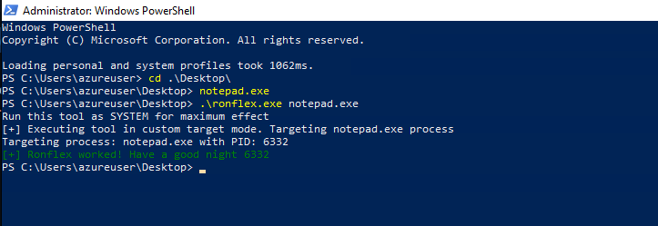

# Ronflex
Attempts to suspend all known AV/EDRs processes on Windows using syscalls and the undocumented NtSuspendProcess API. Made with <3 for pentesters. Written in Rust.

## WARNING
Ronflex tries to suspend all known AV/EDRs and other security product processes. There is a high chance that the system will be unstable after Ronflex did its thing ! Use at your own risks.

## Known limitations
At the moment, Ronflex is not able to suspend processes protected by Anti-Malware Protected Process (AM-PPL), which is now quite common. WIP..

## Todo
- [x] Dynamically load the list of known processes from a file at compile time
- [x] Check if the process is running in elevated context
- [x] Write PROCEXP driver to disk
- [x] Create the appropriate registry keys to load the driver
- [x] Get SE_LOAD_DRIVER privilege for the current process
- [ ] Load the PROCEXP driver using NtLoadDriver
- [ ] Call the driver using DeviceIoControl
- [ ] Suspend all target processes 
- [ ] Clean, fmt, and clippy the code
- [ ] Update the PROCEXP driver to the latest one
- [ ] Move all Windows calls to indirect syscalls

# Quick start
No time ? Let's make it short then.

## Binary
In case of an emergency, you will find a ready to deploy x64 binary for Windows in the repo Release section. However, consider taking the time to compile it yourself.

## Cross-compile from Linux

Install and configure Rust:
- https://www.rust-lang.org/tools/install
- `rustup target add x86_64-pc-windows-gnu`

Build the binary:
- `git clone https://github.com/Nariod/ronflex.git`
- `cd ronflex`
- `cargo build --release --target x86_64-pc-windows-gnu`

## Compile on Windows

Install and configure Rust:
- https://www.rust-lang.org/tools/install
- `rustup target add x86_64-pc-windows-msvc`

Build the binary:
- `git clone https://github.com/Nariod/ronflex.git`
- `cd ronflex`
- `cargo build --release`

## Usage
Run the binary with the highest privileges you can and without argument to freeze all known security products:
- `ronflex.exe`

Alternatively, you can freeze a specific target process by passing the exact process name:
- `ronflex.exe notepad.exe`

# Usage and details
WIP

## Credits
- janoglezcampos for his [rust_syscalls](https://github.com/janoglezcampos/rust_syscalls) project
- [The Sliver project](https://github.com/BishopFox/sliver) for the list of known AV/EDRs processes
- Rust discord
- StackOverflow

## Legal disclaimer
Usage of anything presented in this repo to attack targets without prior mutual consent is illegal. It's the end user's responsibility to obey all applicable local, state and federal laws. Developers assume no liability and are not responsible for any misuse or damage caused by this program. Only use for educational purposes.
